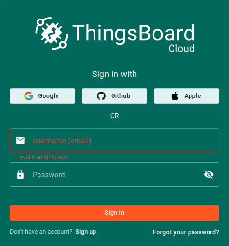
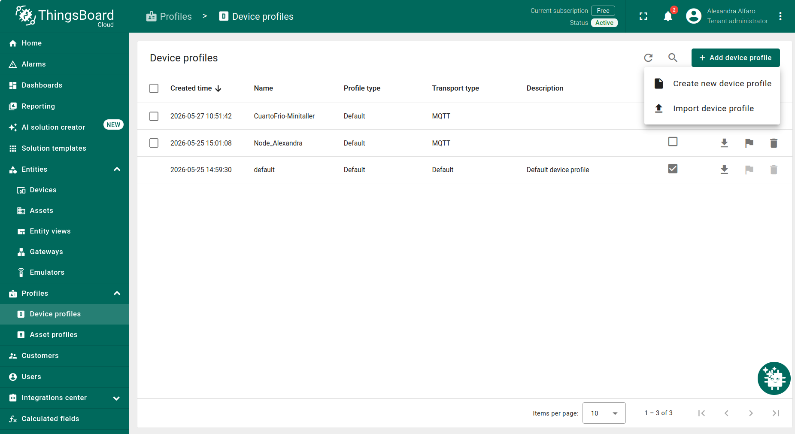
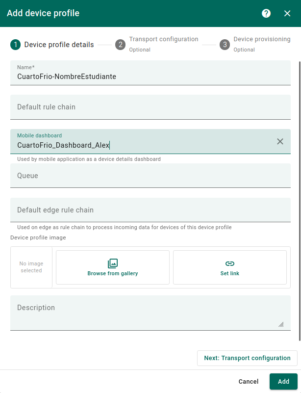
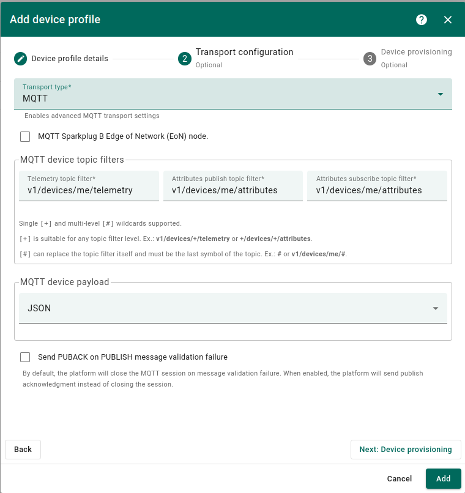
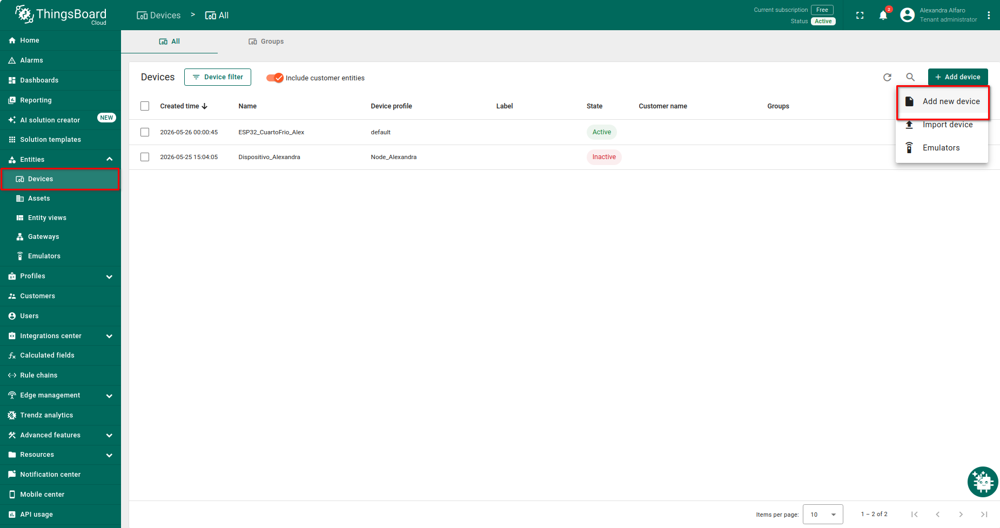
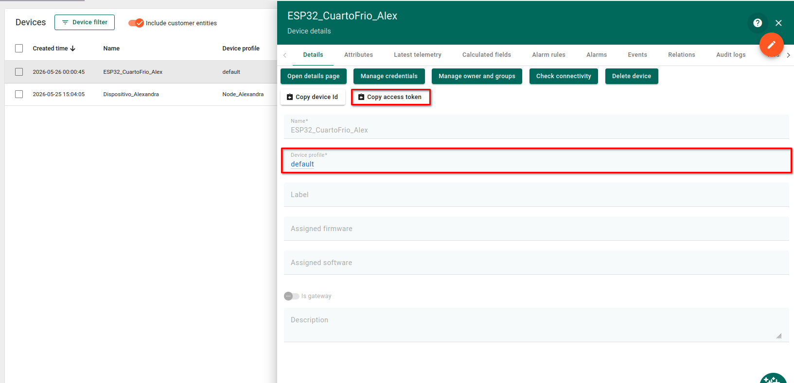
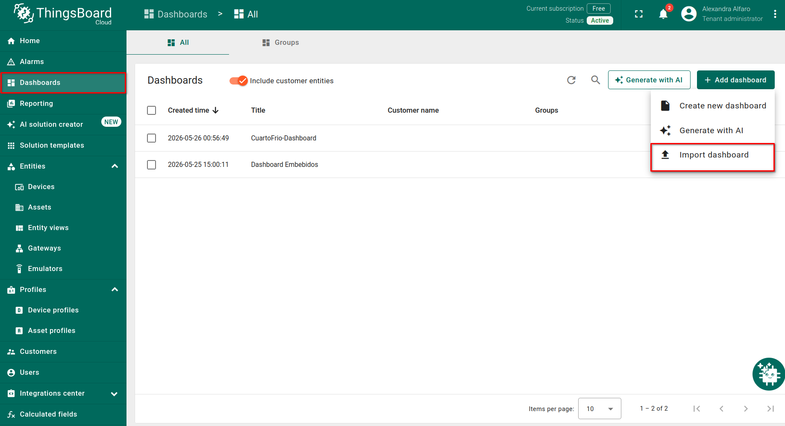
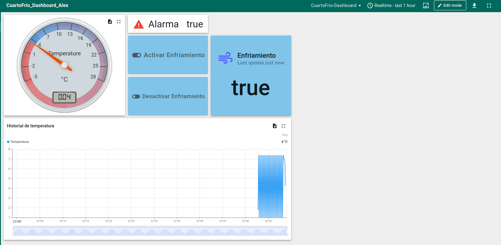
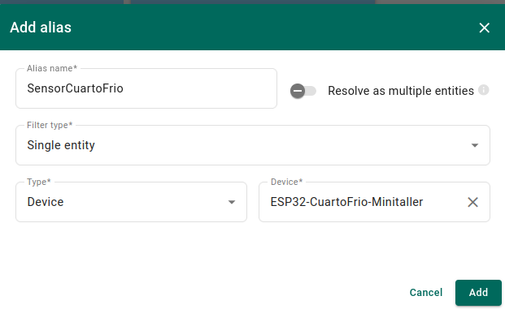
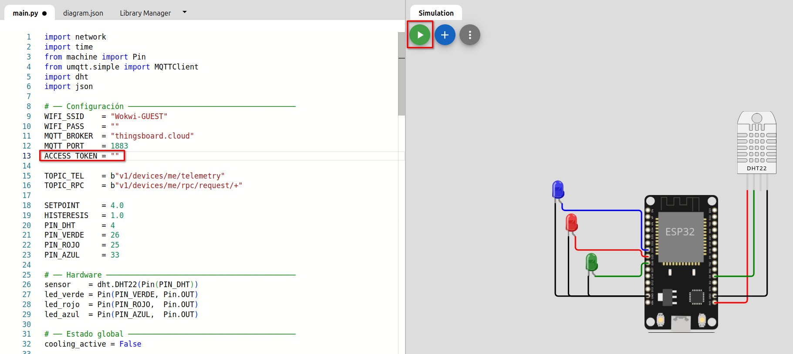

# Tutorial: Gestión de activos IoT con ThingsBoard
## Cuarto frío inteligente
---

## 1. Introducción

En este tutorial se explicará paso a paso cómo configurar un sistema de monitoreo y control de un cuarto frío inteligente utilizando **ThingsBoard Cloud** y una simulación en **Wokwi** con un **ESP32**.

El sistema representa un activo IoT que debe mantenerse por debajo de una temperatura límite llamada **setpoint**. Cuando la temperatura supera ese límite, el sistema activa una alarma visual y permite que un operario intervenga de forma remota desde un dashboard.

---

## 2. Crear cuenta en ThingsBoard Cloud

Ingrese a la siguiente dirección:

```
https://thingsboard.cloud
```

Regístrese con Google, GitHub, Apple, o con correo y contraseña. Una vez dentro verá el panel principal con el menú lateral izquierdo.

<p align="center">
  
</p>

---

## 3. Crear Device Profile

Un **Device Profile** es una plantilla que define el comportamiento de uno o varios devices: qué protocolo de transporte usan, qué alarmas pueden generar y cómo se procesan sus datos.

Diríjase a:

```
Profiles → Device profiles → + → Create new device profile
```
<p align="center">
  
</p>

### 3.1 Device profile details

Asigne el nombre `CuartoFrio` y deje los demás campos en blanco. Haga clic en **Next: Transport configuration**.

<p align="center">
  
</p>

### 3.2 Transport configuration

En **Transport type** seleccione `MQTT`. Esto indica que los devices con este perfil se comunicarán usando el protocolo MQTT. Deje el resto de configuraciones por defecto y haga clic en **Next: Alarm rules**.

<p align="center">
  
</p>

### 3.3 Alarm rules

Deje esta sección vacía por ahora y haga clic en **Add** para finalizar.

El Device Profile `CuartoFrio` aparecerá en la lista.

---

## 4. Crear device

El device representa el ESP32 dentro de ThingsBoard. Es la entidad digital que recibe la telemetría y puede recibir comandos remotos.

Diríjase a:

```
Entities → Devices → + Add device → Add new device
```
<p align="center">
  
</p>

Complete el formulario con los siguientes datos:

- **Name:** `ESP32-CuartoFrio-TuNombre`
- **Device profile:** seleccione `CuartoFrio`

Haga clic en **Add**.

### 4.1 Copiar el Access Token

El Access Token es la credencial que usa el ESP32 para autenticarse con ThingsBoard vía MQTT. Sin él, el broker rechaza la conexión.

Abra el device recién creado y haga clic en:

```
Copy access token
```

Guarde el token. Lo necesitará más adelante. 

<p align="center">
  
</p>

> **Importante:** no comparta este token. Cualquiera que lo tenga puede publicar datos en su device.

---

## 5. Importar el dashboard

El dashboard ya está configurado con todos los widgets necesarios. Solo debe importarlo y conectarlo a su device.

Diríjase a:

```
Dashboards → + Add dashboard → Import dashboard
```
<p align="center">
  
</p>

Suba el archivo proporcionado:

```
cuartofrio-dashboard-minitaller.json
```

El dashboard aparecerá en su lista. Ábralo para continuar.

<p align="center">
  
</p>

---

## 6. Conectar el dashboard al device

El dashboard importado debe redirigirse al device propio de cada estudiante.

Con el dashboard abierto, active el modo edición y haga clic en **Aliases** en la barra superior:
```
Edit mode → Aliases
```
Verá un alias existente llamado `SensorCuartoFrio`. Haga clic en el ícono de edición y en el campo **Device** reemplace el device actual por el suyo:
```
ESP32-CuartoFrio-TuNombre
```
<p align="center">
  
</p>

Guarde. El dashboard ahora muestra los datos de su propio device.

---

## 7. Configurar Wokwi

Para modelar el sistema físico se utilizará una simulación en **Wokwi**. Use el proyecto disponible en [este enlace](https://wokwi.com/projects/465060950713837569), que ya incluye el circuito con el ESP32, el sensor DHT22 y los tres LEDs conectados.

Solo es necesario agregar el Access Token del device recién creado. Para obtenerlo, abra el device en ThingsBoard, seleccione **Copy access token** y péguelo en el archivo `main.py`, en la variable de la línea 13:

```python
ACCESS_TOKEN = ""
```

Presione ▶ para iniciar la simulación. Espere 10-15 segundos mientras el ESP32 se conecta al WiFi y al broker MQTT.

<p align="center">
  
</p>

---

## 8. Resultado final

Con Wokwi corriendo y el dashboard configurado, observe la siguiente secuencia:

1. La temperatura sube de 1°C a 7°C en pasos de 0.8°C cada segundo.
2. Mientras está por debajo de 4°C, el **LED verde** está encendido y `alarmStatus` es `false`.
3. Cuando supera 4°C, el **LED rojo** se enciende y el verde se apaga.
4. En el dashboard presione **Activar Enfriamiento** — el **LED azul** se enciende.
5. Cuando la temperatura baja de 4°C, el sistema apaga el enfriamiento automáticamente.

El dashboard mostrará los widgets de temperatura, alarma, enfriamiento, historial y los botones de control.

---

## Troubleshooting

**El device no aparece activo**

Verifique que Wokwi está corriendo, que el Access Token en la línea 13 del código es correcto y no tiene espacios extra. Espere 15 segundos después de presionar ▶.

**No aparecen datos en el dashboard**

Verifique que el alias del dashboard apunta a su device. Confirme que el device aparece activo en Latest telemetry.

**Error `MQTTException: 5` en Wokwi**

El token está mal copiado o el broker es incorrecto. El broker debe ser exactamente `thingsboard.cloud`.

**Los botones RPC no tienen efecto**

El nombre del método es sensible a mayúsculas. Verifique que coincide exactamente: `activarEnfriamiento` y `desactivarEnfriamiento`.
