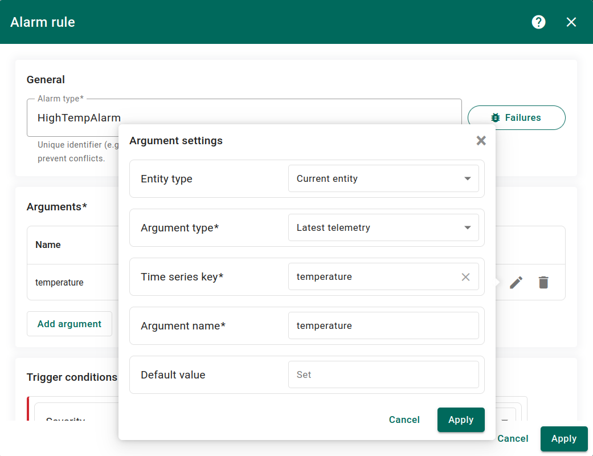
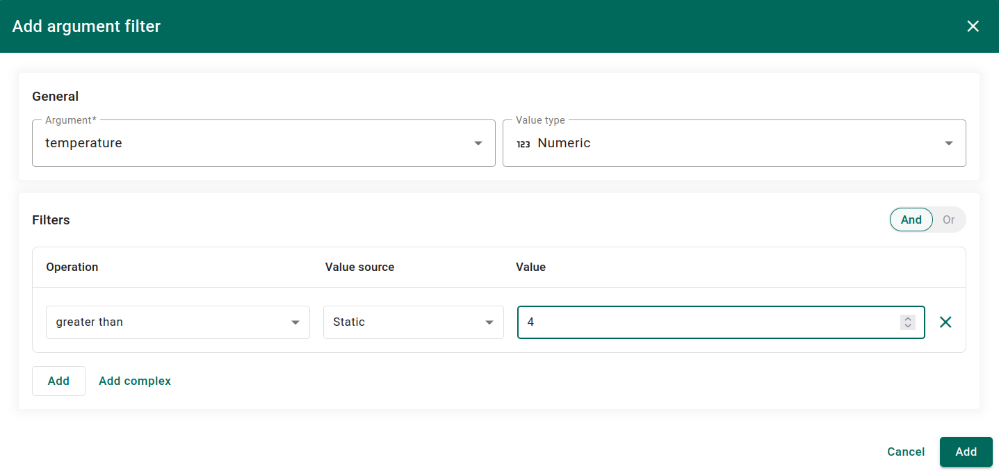
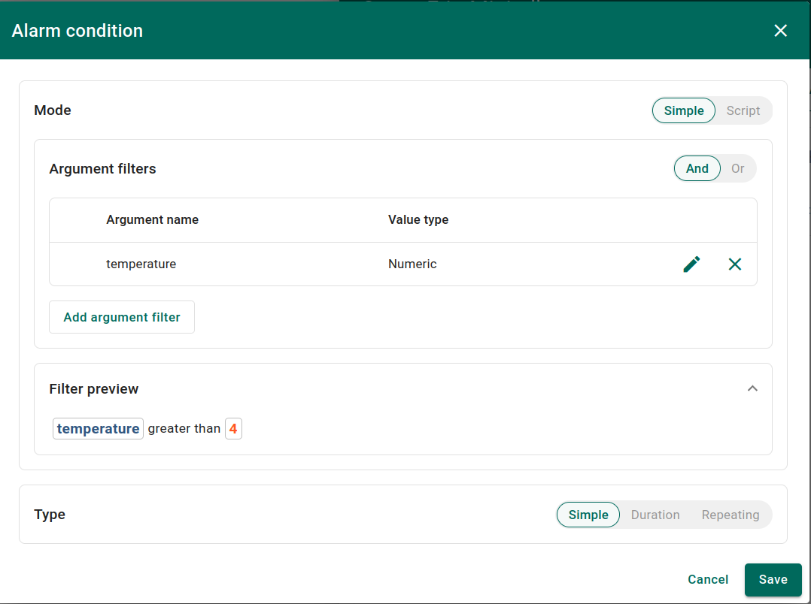
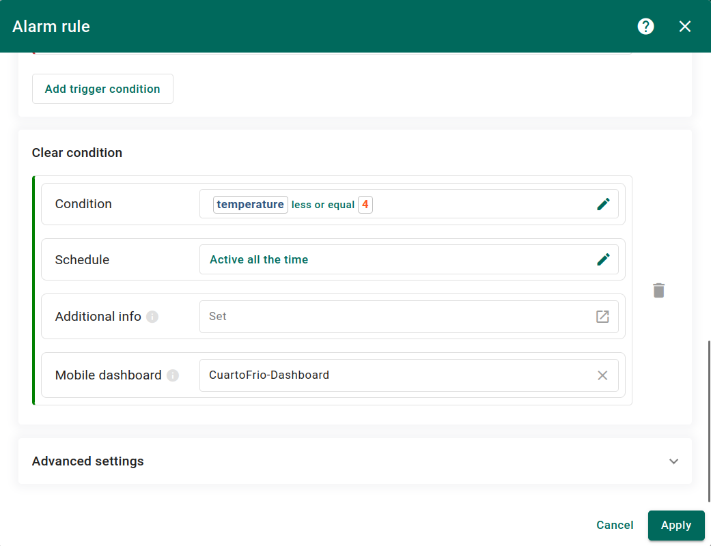
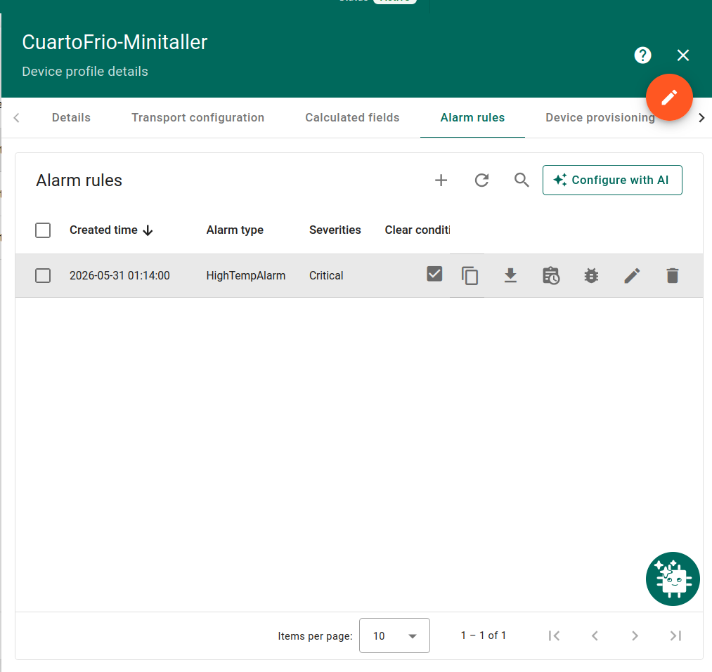

# Guía para estudiantes: Automatización y alarmas
## Cuarto frío inteligente — Taller de Sistemas Embebidos

## Introducción

En clase configuraron el sistema en modo **MANUAL**: cuando la temperatura superaba el setpoint, el operario debía presionar un botón en el dashboard para activar el enfriamiento.

En esta guía harán dos cosas:

1. Configurar una alarma en ThingsBoard que se active automáticamente cuando la temperatura supere el setpoint
2. Modificar el firmware para que el enfriamiento se active solo, sin intervención del operario

Al finalizar, el sistema pasará de esto:

```
Temperatura sube → alarma → operario presiona botón → enfriamiento ON
```

A esto:

```
Temperatura sube → alarma → firmware activa enfriamiento solo
```

---

## Parte 1 — Configurar la alarma en ThingsBoard

### 1.1 Abrir el Device Profile

Diríjase a:

```
Profiles → Device profiles → CuartoFrio
```

Abra el perfil y diríjase a la pestaña **Alarm rules**.

### 1.2 Crear la regla de alarma

Haga clic en **+ Add alarm rule**. Complete el campo **Alarm type** con:

```
HighTempAlarm
```

### 1.3 Agregar el argumento

En la sección **Arguments**, haga clic en **Add argument** y complete los campos:

- **Entity type:** `Current entity`
- **Argument type:** `Latest telemetry`
- **Time series key:** `temperature`
- **Argument name:** `temperature`
- **Default value:** dejar vacío

Haga clic en **Add**.

<p align="center">
  
</p>

### 1.4 Agregar la condición de disparo

En la sección **Trigger conditions**, haga clic en **Add trigger condition**. Seleccione **Severity:** `Critical` y haga clic en **Add condition**.

En el diálogo **Alarm condition**, haga clic en **Add argument filter** y configure:

- **Argument:** `temperature`
- **Value type:** `Numeric`
- **Operation:** `greater than`
- **Value source:** `Static`
- **Value:** `4`

<p align="center">
  
</p>

El **Filter preview** debe mostrar:

```
temperature greater than 4
```

<p align="center">
  
</p>

### 1.5 Agregar la condición de limpieza

En la sección **Clear condition**, haga clic en **Add clear condition** y configure el filtro de la misma forma que en el paso anterior, pero con la operación inversa:

- **Argument:** `temperature`
- **Value type:** `Numeric`
- **Operation:** `less than or equal to`
- **Value source:** `Static`
- **Value:** `4`

Esto hace que la alarma cambie de estado **Active → Cleared** automáticamente cuando la temperatura baje a 4°C o menos.

Haga clic en **Apply** para guardar la regla completa.
<p align="center">
  
</p>

Haga clic en **Save** y luego en **Add** para guardar la regla de alarma completa.

<p align="center">
  
</p>

### 1.6 Verificar la alarma

Con Wokwi corriendo, espere a que la temperatura supere 4°C. En ThingsBoard verá:

- La alarma aparece en la pestaña **Alarms** del device
- La campanita en la esquina superior derecha muestra una notificación nueva
- El widget de alarma en el dashboard se activa

---

## Parte 2 — Cambiar el firmware a modo AUTO

### 2.1 Abrir el proyecto en Wokwi

Abra su proyecto en Wokwi y diríjase al archivo `main.py`.

### 2.2 Modificar la lógica de control

Localice este bloque en el loop principal:

```python
# Control manual — operario activa desde ThingsBoard
if not alarm_active:
    cooling_active = False
```

Reemplácelo por este:

```python
# Control automático con histéresis
if temperature > SETPOINT:
    cooling_active = True
elif temperature <= (SETPOINT - HISTERESIS):
    cooling_active = False
```

### 2.3 Cambiar el campo mode en la telemetría

Localice esta línea dentro del payload:

```python
"mode": "MANUAL"
```

Cámbiela por:

```python
"mode": "AUTO"
```

### 2.4 Reiniciar la simulación

Detenga la simulación con ■ y vuelva a presionar ▶. Observe el comportamiento:

- Cuando la temperatura supera 4°C el **LED azul** se enciende solo
- Cuando la temperatura baja de 3°C el **LED azul** se apaga solo
- El dashboard muestra `coolingStatus: true` sin que nadie presione el botón

---

## ¿Por qué 3°C y no 4°C para apagar?

Esto se llama **histéresis**. Si el sistema se apagara exactamente en 4°C, volvería a encenderse inmediatamente porque la temperatura sube de nuevo. La histéresis introduce un margen: el sistema enciende en 4°C pero apaga en 3°C, evitando que el actuador se encienda y apague continuamente.

```
Ventilador ON  → temperature > 4.0°C
Ventilador OFF → temperature <= 3.0°C
```

---

## Parte 3 — Entregables

Tome capturas de pantalla que evidencien:

1. La alarma activa en la pestaña **Alarms** del device
2. La notificación en la campanita de ThingsBoard
3. El dashboard con `coolingStatus: true` y `mode: AUTO`
